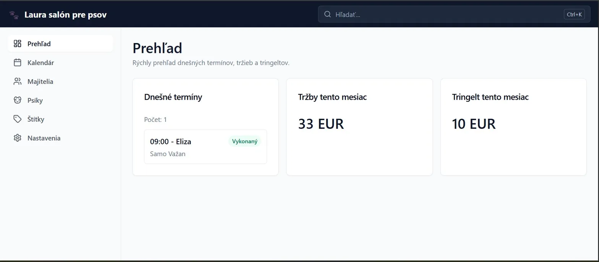
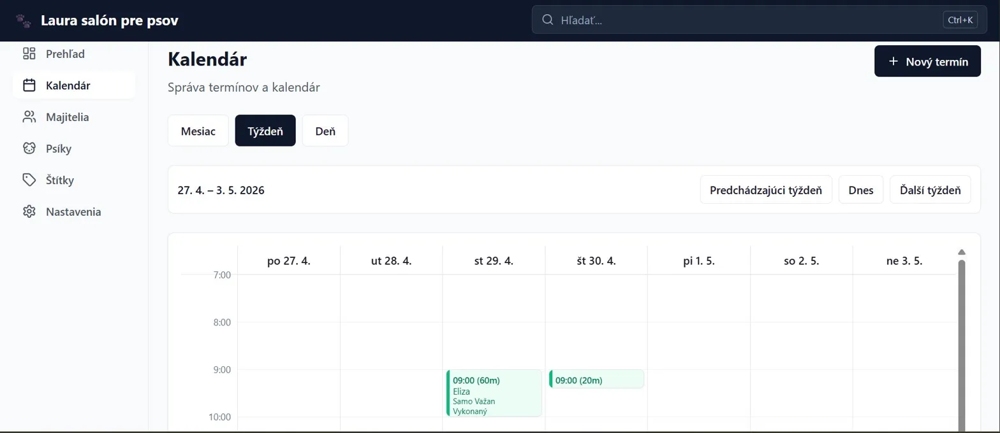
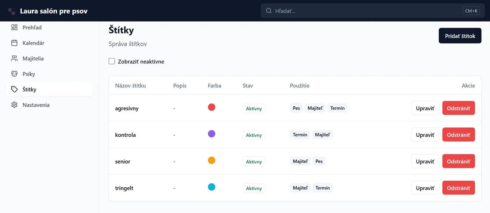
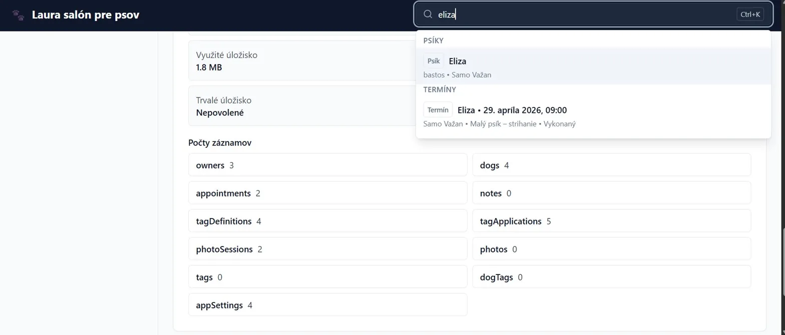
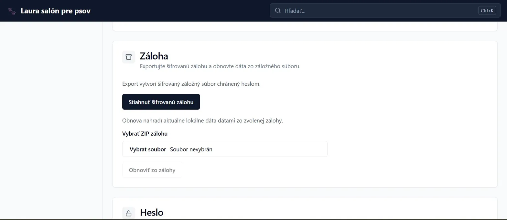

# Laura - Offline-First Dog Grooming Salon CRM

Laura is a local-first progressive web app for a dog grooming salon. It manages owners, dogs, appointments, tags, notes, photos, reports, and encrypted backups directly in the browser using IndexedDB.

> **Live demo:** [laura-ten.vercel.app](https://laura-ten.vercel.app)

## Screenshots

| Dashboard | Calendar |
|---|---|
|  |  |

| Tag Manager | Global Search |
|---|---|
|  |  |

| Backup & Security |
|---|
|  |

## MVP Features

- **Dashboard / overview** for daily appointments, revenue, and tips.
- **Calendar** with month, week, and day views.
- **Appointment management** with status, service, price, tip, payment state, dirty-dog flag, notes, and tags.
- **Owner and dog CRM** with owner notes, GDPR consent flag, dog notes, and owner/dog detail pages.
- **Scoped tag system** for owners, dogs, and appointments, including active/inactive tags.
- **Photos** for appointment before/after sessions plus separate owner and dog galleries.
- **Reports** for closed appointments: daily, weekly, and monthly revenue, tips, workload, paid/unpaid split, service breakdown, and printable report output.
- **Global search** across owners, dogs, appointments, tags, and related context.
- **Encrypted backup export and restore** including structured data and photo files.
- **Password lock** for the app UI.
- **Offline/PWA support** after the first load.

## Data, Security, and Backups

Laura stores data locally in the browser/device through Dexie and IndexedDB. It does not sync data to a cloud service.

Regular backup export is essential. Backups include owners, dogs, appointments, tags, notes, app settings, appointment before/after photos, and owner/dog gallery photos. Restore replaces the current local data with the selected backup data.

The app password is a local UI lock. It helps prevent casual access through the app interface, but it does **not** encrypt the underlying IndexedDB data stored by the browser. Encrypted backup export is separate from the app lock and protects exported backup files when a backup password is chosen.

Browser persistent storage, when available and granted, only reduces the chance that the browser automatically removes local data during storage cleanup. It is not a substitute for backups.

## Stack

- React 18
- TypeScript
- Vite
- Dexie / IndexedDB
- Tailwind CSS and shadcn-style UI primitives
- React Router
- React Day Picker
- FlexSearch
- browser-image-compression
- fflate
- vite-plugin-pwa / Workbox

## Running Locally

```bash
npm install
npm run dev
```

Open [http://localhost:5173](http://localhost:5173).

## Build and Verification

```bash
npm run lint
npm run build
npm run preview
```

## Environment

The app can expose a public build/version label through:

```bash
VITE_APP_VERSION=
```

No API keys or server-side secrets are required for the local/offline MVP.

## License

MIT
